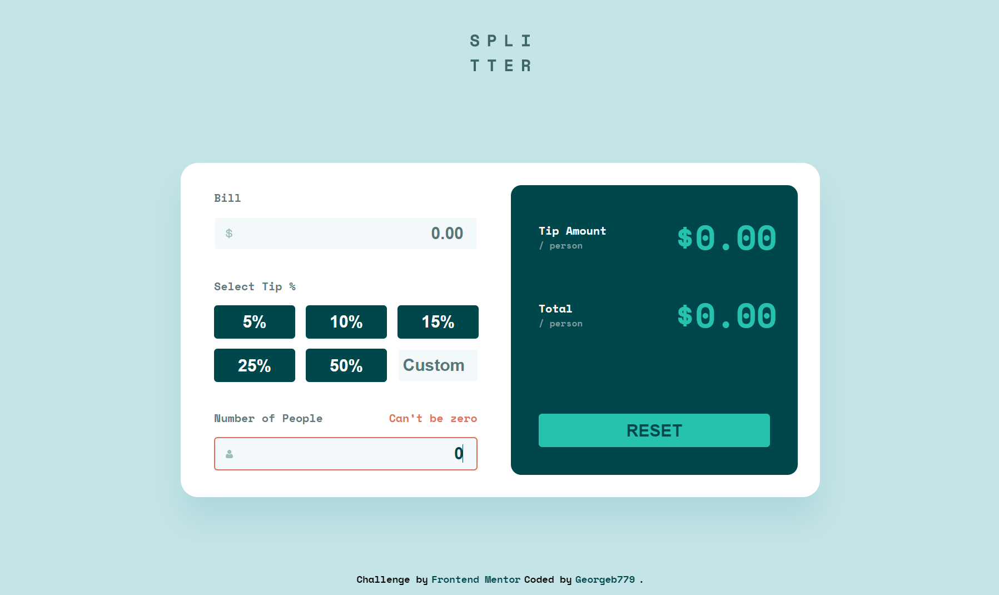

# Frontend Mentor - Tip calculator app

This is a solution to the [Tip calculator app challenge on Frontend Mentor](https://www.frontendmentor.io/challenges/tip-calculator-app-ugJNGbJUX). This small app is perfect for anyone starting to get to grips with JavaScript. The calculator functionality will be a nice test!


## 🧐 What's inside?

This Starter includes

- ⚡ [vite] (https://vitejs.dev/) - a fast and lightweight development server
- ⚛️ [React 18](https://reactjs.org/) - A JavaScript library for building user interfaces
- ✨ [TypeScript](https://www.typescriptlang.org/) - TypeScript is a strongly typed programming language that builds on JavaScript, giving you better tooling at any scale.
- 🎉 [Sass](https://sass-lang.com/) - Sass is the most mature, stable, and powerful professional grade CSS extension language in the world.


## Overview

## 🚀 Getting Started

```
# Install dependencies

npm install
# or
yarn install

# Start development server

yarn dev
# or
npm run dev

# Build for production

yarn build
# or
npm run build
```

### The challenge

Users should be able to:

- View the optimal layout for the app depending on their device's screen size.

- See hover states for all interactive elements on the page.

- Calculate the correct tip and total cost of the bill per person.

### Screenshot




### Links

- Solution URL: [Link to solution URL here](https://www.frontendmentor.io/solutions/tip-calculator-app-CgiKZvPkrT)
- Live Site URL: [Link to live site](https://tip-calculator-app-gb.netlify.app/)

## Author

- Frontend Mentor - [@Georgeb79](https://www.frontendmentor.io/profile/Georgeb779)
- Linkedin - [@GeorgeBaez](https://www.linkedin.com/in/george-baez/)
- Twitter - [@Georgeb779](https://twitter.com/Georgeb779)